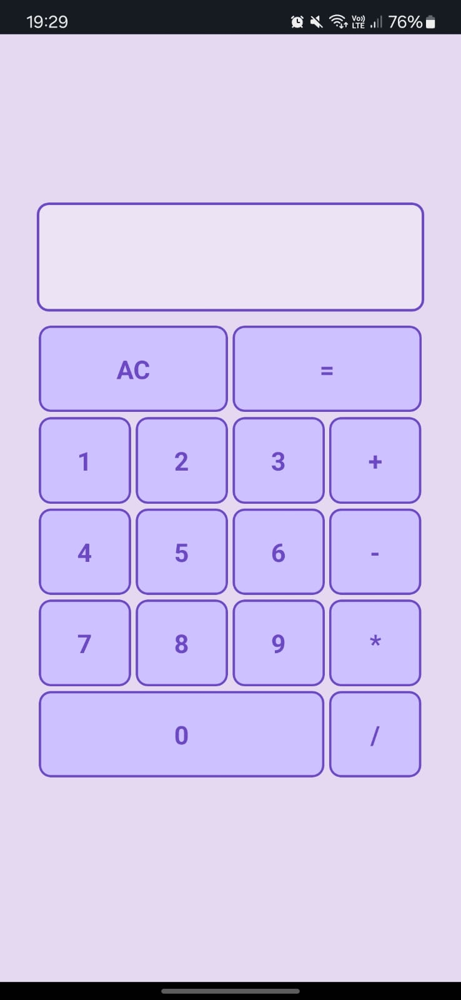

# Calculadora com React Native

Este aplicativo é uma calculadora com design simples e intuitivo, desenvolvida especialmente para Android. Ele foi criado como parte da avaliação da disciplina de Desenvolvimento Mobile do curso técnico da ETEC de Guarulhos, no 2º módulo.

## Screenshots



## Funcionalidades

1. **Operações Matemáticas:** Realize adições, subtrações e multiplicações de números inteiros.
2. **Limpar:** Reinicie os cálculos facilmente.
3. **Design Responsivo:** A interface é adaptável e fácil de usar em diferentes tamanhos de tela.

## Tecnologias Utilizadas

- **React Native:** Framework para construção de aplicativos móveis.
- **Expo:** Ferramenta para desenvolvimento rápido de aplicativos React Native.

## Pré-requisitos

Antes de instalar, certifique-se de que você tem os seguintes pré-requisitos:

- **Node.js:** Versão 14 ou superior instalada em seu sistema.
- **Expo Go:** O aplicativo Expo Go deve estar instalado em seu dispositivo Android **ou** você pode usar o **Android Studio** para emular o aplicativo.

## Como Instalar

1. Clone o repositório:
    ```bash
    git clone https://github.com/mvsilvass/react-native-calculator
    ```
2. Navegue até o diretório do projeto:
    ```bash
    cd react-native-calculator
    ```
3. Instale as dependências:
    ```bash
    npm install
    ```
4. Inicie o projeto:
    ```bash
    npx expo start
    ```
5. Abra o aplicativo no seu dispositivo ou em um emulador:

   - Se estiver com seu Android em mãos, com o aplicativo Expo Go, escaneie o código QR que aparece no terminal.
   - Se estiver usando um emulador, você pode selecionar a opção Android correspondente para iniciar o aplicativo no emulador.

## Licença

Este projeto está licenciado sob a [MIT License](LICENSE). Veja o arquivo [LICENSE](LICENSE) para mais detalhes.
